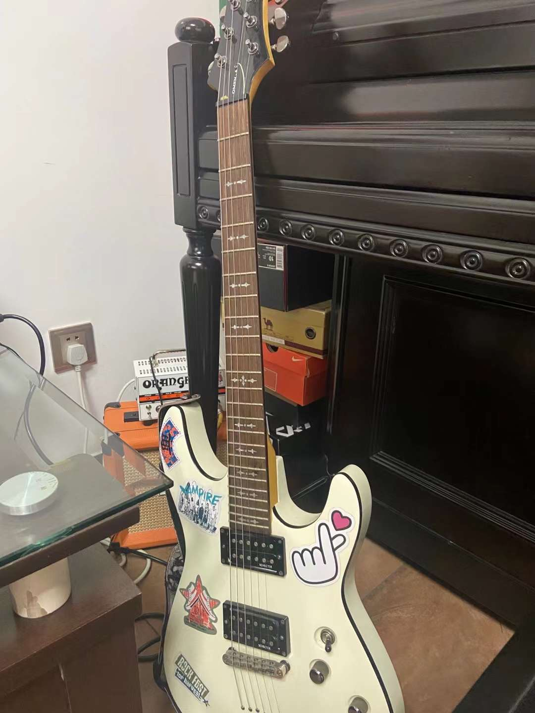

I am a first year Master of Science student at Columbia University. I am currently in the department of Biostatistics. I am extremely interested in working on data and I want to pursue a career in healthcare industry. I am good at playing guitar and I am a rock music fan. I used to be a guitarist in a music band.

I am also a fan of Anime. Here's a picture I took at Akihabara, Tokyo.

